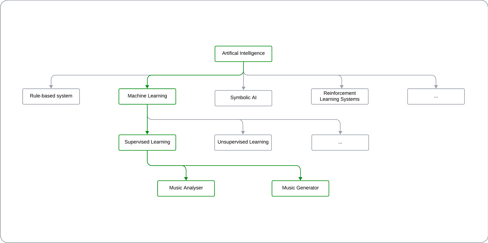
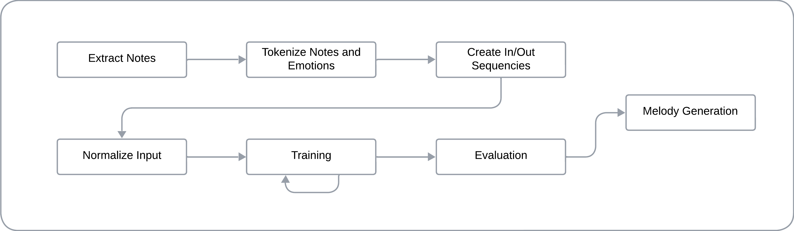

# Introduction
```
(0 - 2 minutes: explanation of the branching definitions Artificial Intelligence -> Machine Learning -> Neural Network -> Generative AI).
```
During the course, we analyzed how AI and intelligent systems can be used to solve logical problems of various kinds. However, when applying these systems to music, an intriguing challenge arises: musical composition is not a purely "logical" task, even though it has a strong mathematical component. This led me to reflect on how complex it is for an AI system to understand and express emotions, a crucial element in the musical domain.

Among the various artificial intelligence systems available  
  
*(For an overview of other types of AI, you can visit [here](readme_files/AI_fields.md))*  
I chose to use machine learning systems, with a particular focus on neural networks, to explore the ability of simple learning models to replicate emotions.

The choice is based on the flexibility of neural networks in modeling complex phenomena and their ability to learn rich representations from data. Specifically, I applied these techniques to two problems:  
  1. The classification of emotions conveyed by musical tracks.  
  2. The generation of melodies conditioned by specific emotions.  

This exploration seeks to address a central question: can an AI system, based on relatively simple algorithms, not only "understand" but also "express" emotions through music?

# System Configuration
To execute the scripts we will discuss later, we need to install several libraries. Use the following command to install them:
```
pip install pandas librosa numpy joblib tqdm scikit-learn tensorflow music21
```
The libraries used are:
1. **NumPy:** A fundamental library for fast numerical operations and multidimensional arrays, essential for scientific computation.
2. **Pandas:** Crucial for data manipulation and analysis, such as reading CSV files and managing structured tables.
3. **Scikit-learn:** Provides tools for dataset splitting, label encoding, and other basic machine learning functionalities.
4. **TensorFlow:** An advanced deep learning library used to build, train, and save neural network models.
5. **Librosa:** Used for processing audio files, including feature extraction (e.g., MFCC). It is key for audio analysis.
6. **Music21:** Necessary for handling MIDI files, analyzing notes and chords, and creating melodies.
7. **Joblib:** Used for parallel processing to speed up data handling or complex functions.
8. **TQDM:** Adds a progress bar to monitor iterative processes, especially useful for large datasets.
9. **Pickle:** Part of Python's standard library; no installation required. Used for saving and loading objects, such as label encoders.
10. **OS and Glob:** Both are part of Python's standard library. OS is used for file and directory management, while Glob works with file name patterns.
11. **Collections (Counter):** Another standard Python library, used for operations like counting elements in a list.

Additionally, we will use the following datasets:
* Dataset for the first script: [DEAM](http://cvml.unige.ch/databases/DEAM/).
* Dataset for the second script: [EMOPIA](https://zenodo.org/records/5090631#.YPPo-JMzZz8).  
*(You can find additional information about the two datasets [here](readme_files/dataset_info.md))*

# Song Emotion Analysis Code
The goal is to create and train a model that recognizes the primary type of emotion a given song conveys to the listener. For simplicity, we will use a very basic set of emotions, categorizing the entire emotional spectrum into just the labels of **happiness**, **sadness**, and **fear**.


*(you can read a deeper analysis of the code [here](readme_files/code1_description.md))*
### 1. Data Loading
``` Python
annotations = pd.read_csv('data/annotations/annotations averaged per song/song_level/static_annotations_averaged_songs_1_2000.csv')
```
### 2. Emotion Assignment
We define a function to map the valence and arousal values to the emotions:
``` Python
def assign_emotion(row):
	valence = row[' valence_mean']
	arousal = row[' arousal_mean']
	if valence > 5 and arousal > 5:
		return 'happiness'
	elif valence <= 5 and arousal <= 5:
		return 'sadness'
	elif valence <= 5 and arousal > 5 and arousal < 7:
		return 'fear'
	elif valence <= 5 and arousal >= 7:
		return 'anger'
	else:
		return None # Esclude altri stati emotivi
```
and we apply that function to each song:
``` Python
annotations['emotion'] = annotations.apply(assign_emotion, axis=1)
```
The terminal output at this point is:
```
    song_id  valence_mean   valence_std   arousal_mean   arousal_std    emotion
0        2            3.1          0.94            3.0          0.63    sadness
3        5            4.4          2.01            5.3          1.85       fear
4        7            5.8          1.47            6.4          1.69  happiness
```
and the distribution of emotions in the dataset is:
```
emotion
sadness      729
happiness    582
fear         210
```
### 3. Features Extraction (MFCC)
We define a function to extract the songs features:
``` Python
def extract_features(file_name):
	try:
		audio_data, sample_rate = librosa.load(file_name, res_type='kaiser_fast')
		# Estrazione delle MFCC
		mfccs = librosa.feature.mfcc(y=audio_data, sr=sample_rate, n_mfcc=40)
		mfccs_scaled = np.mean(mfccs.T, axis=0)
		return mfccs_scaled
	except Exception as e:
		print(f"Errore nell'elaborazione del file {file_name}: {e}")
		return None
```
We apply the previously mentioned function to all the audio files:
```
100%|████████████████████████████████| 1521/1521 [03:45<00:00, 6.76it/s]
Numero di campioni con caratteristiche estratte: 1521
```
### 3. Data Preparation
We now have the **features** matrix and the **labels** vector. We can create a DataFrame to serve as input for our neural network:
``` Python
features_df = pd.DataFrame(features, columns=['feature', 'label'])
```
The data structure will be of the type:
```
	feature                                             label
0  [-144.26477, 123.45465, -21.118523, 36.46806, ...    sadness
1  [-148.90979, 125.012566, -3.8318107, 33.42975,...       fear
2  [-155.02774, 115.9887, 19.196737, 53.457127, 1...  happiness
3  [-294.01443, 138.91287, 71.07505, 36.631863, 8...    sadness
4  [-270.40778, 132.17728, 3.762553, 25.400993, 1...    sadness
...
```
We derive **X** and **yy**:
```Python
# Otteniamo X
X = np.array(features_df['feature'].tolist())
# Otteniamo yy
y = np.array(features_df['label'].tolist())
le = LabelEncoder()
yy = to_categorical(le.fit_transform(y))
```
We partition the elements to obtain a *train set* and a *test set*:
```Python
x_train, x_test, y_train, y_test = train_test_split(X, yy, test_size=0.2, random_state=42)
```
The resulting data structures will be:
```
Forma di X: (1521, 40)
Forma di yy: (1521, 3)
Numero di campioni nel training set: 1216
Numero di campioni nel testing set: 305
```
### 4. Training
```
 Layer (type)                        │ Output Shape                │ Param #
━━━━━━━━━━━━━━━━━━━━━━━━━━━━━━━━━━━━━┿━━━━━━━━━━━━━━━━━━━━━━━━━━━━━┿━━━━━━━━━━━
 dense (Dense)                       │ (None, 256)                 │ 10,496
 activation (Activation)             │ (None, 256)                 │ 0
 dropout (Dropout)                   │ (None, 256)                 │ 0
─────────────────────────────────────┼─────────────────────────────┼───────────
 dense_1 (Dense)                     │ (None, 128)                 │ 32,896
 activation_1 (Activation)           │ (None, 128)                 │ 0
 dropout_1 (Dropout)                 │ (None, 128)                 │ 0
─────────────────────────────────────┼─────────────────────────────┼───────────
 dense_2 (Dense)                     │ (None, 3)                   │ 387
 activation_2 (Activation)           │ (None, 3)                   │ 0
```
We train the model:
```Python
checkpointer = ModelCheckpoint(filepath='saved_models/audio_classification.keras', verbose=1, save_best_only=True)

history = model.fit(x_train, y_train, batch_size=32, epochs=20, validation_data=(x_test, y_test), callbacks=[checkpointer], verbose=1)
```
### 5. Test
At the end of the training, we use the test set
```Python
model.load_weights('saved_models/audio_classification.keras')
score = model.evaluate(x_test, y_test, verbose=0)
```
to evaluate the prediction accuracy. The result obtained is:
```
Accuracy sul test set: 70.49%
```
### 6. Prediction
From the initial song dataset, I removed the samples [3.mp3](test/3.mp3) and [4.mp3](test/4.mp3) and placed these samples in a separate test folder, apart from the other dataset elements.

We will use these two songs to test if the model's prediction matches the emotion I perceived while listening to these two songs. The terminal output is:
```
L'emozione predetta per 'test/4.mp3' è: happiness

L'emozione predetta per 'test/3.mp3' è: sadness
```
which matches the emotion perceived while listening to the two tracks.

# Song Emotion Generation Code

*(you can read a deeper analysis of the code [here](readme_files/code2_description.md))*
