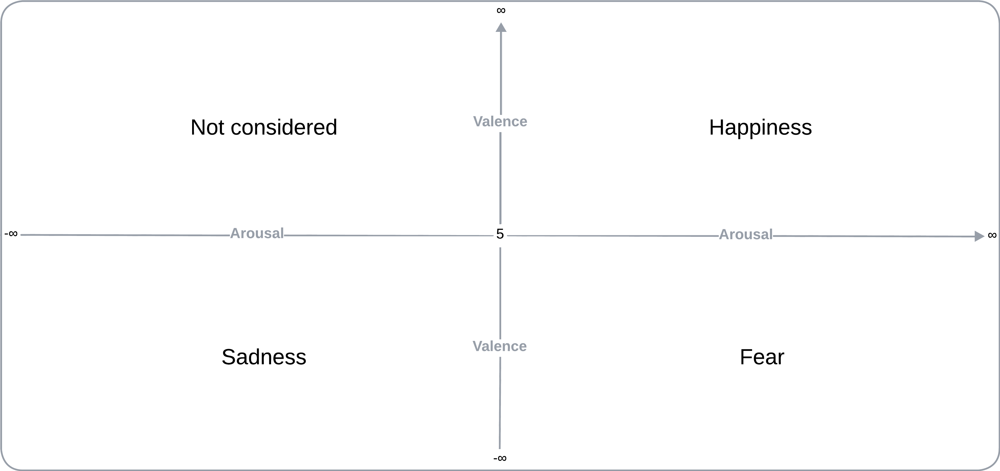

# Table of Contents

1. [Introduction](#introduction)  
   - Overview of AI in music for emotion analysis and generation.  
   - Focus on neural networks for emotion classification and melody generation.

2. [System Configuration](#system-configuration)  
   - Required libraries and datasets ([DEAM](http://cvml.unige.ch/databases/DEAM/), [EMOPIA](https://zenodo.org/records/5090631#.YPPo-JMzZz8)).

3. [Emotion Analysis Code](#emotion-analysis-code)  
   - Data preprocessing, feature extraction, and model training.  
   - Emotion classification and test predictions.

4. [Emotion Generation Code](#emotion-generation-code)  
   - Note extraction, sequence creation, and GRU model training.  
   - Melody generation and MIDI file export. 

# Introduction
During the course, we analyzed how AI and intelligent systems can be used to solve logical problems of various kinds. However, when applying these systems to music, an intriguing challenge arises: musical composition is not a purely "logical" task, even though it has a strong mathematical component. This led me to reflect on how complex it is for an AI system to understand and express emotions, a crucial element in the musical domain.

Among the various artificial intelligence systems available  
  
*(For an overview of other types of AI, you can visit [here](readme_files/AI_fields.md))*  
I chose to use machine learning systems, with a particular focus on neural networks, to explore the ability of simple learning models to replicate emotions.

The choice is based on the flexibility of neural networks in modeling complex phenomena and their ability to learn rich representations from data. Specifically, I applied these techniques to two problems:  
  1. The classification of emotions conveyed by musical tracks.  
  2. The generation of melodies conditioned by specific emotions.  

This exploration seeks to address a central question: can an AI system, based on relatively simple algorithms, not only "understand" but also "express" emotions through music?

# System Configuration
To execute the scripts we will discuss later, we need to install several libraries. Use the following command to install them:
```
pip install pandas librosa numpy joblib tqdm scikit-learn tensorflow music21
```
The libraries used are:
1. **NumPy:** A fundamental library for fast numerical operations and multidimensional arrays, essential for scientific computation.
2. **Pandas:** Crucial for data manipulation and analysis, such as reading CSV files and managing structured tables.
3. **Scikit-learn:** Provides tools for dataset splitting, label encoding, and other basic machine learning functionalities.
4. **TensorFlow:** An advanced deep learning library used to build, train, and save neural network models.
5. **Librosa:** Used for processing audio files, including feature extraction (e.g., MFCC). It is key for audio analysis.
6. **Music21:** Necessary for handling MIDI files, analyzing notes and chords, and creating melodies.
7. **Joblib:** Used for parallel processing to speed up data handling or complex functions.
8. **TQDM:** Adds a progress bar to monitor iterative processes, especially useful for large datasets.
9. **Pickle:** Part of Python's standard library; no installation required. Used for saving and loading objects, such as label encoders.
10. **OS and Glob:** Both are part of Python's standard library. OS is used for file and directory management, while Glob works with file name patterns.
11. **Collections (Counter):** Another standard Python library, used for operations like counting elements in a list.

Additionally, we will use the following datasets:
* Dataset for the first script: [DEAM](http://cvml.unige.ch/databases/DEAM/).
* Dataset for the second script: [EMOPIA](https://zenodo.org/records/5090631#.YPPo-JMzZz8).  
*(You can find additional information about the two datasets [here](readme_files/dataset_info.md))*

# Code1: Song Emotion Analysis
The goal is to create and train a model that recognizes the primary type of emotion a given song conveys to the listener. For simplicity, we will use a very basic set of emotions, categorizing the entire emotional spectrum into just the labels of **happiness**, **sadness**, and **fear**.


*(you can read a deeper analysis of the code [here](readme_files/code1_description.md))*
### 1. Data Loading
``` Python
annotations = pd.read_csv('data/annotations/annotations averaged per song/song_level/static_annotations_averaged_songs_1_2000.csv')
```
The CSV file contains average values for valence (positivity of emotion) and arousal (intensity of emotion) for each song.

### 2. Emotion Assignment

We define a function to map the valence and arousal values to the emotions:
``` Python
def assign_emotion(row):
    valence = row[' valence_mean']
    arousal = row[' arousal_mean']
    if valence > 5 and arousal > 5:
        return 'happiness'
    elif valence <= 5 and arousal <= 5:
        return 'sadness'
    elif valence <= 5 and arousal > 5:
        return 'fear'
    else:
        return None  # Esclude altri stati emotivi
```
The function is applied to each row in the dataset, and the assigned emotion is saved in a new column emotion:
``` Python
annotations['emotion'] = annotations.apply(assign_emotion, axis=1)
```
The terminal output at this point is:
```
    song_id  valence_mean   valence_std   arousal_mean   arousal_std    emotion
0        2            3.1          0.94            3.0          0.63    sadness
3        5            4.4          2.01            5.3          1.85       fear
4        7            5.8          1.47            6.4          1.69  happiness
```
and the distribution of emotions in the dataset is:
```
emotion
sadness      729
happiness    582
fear         210
```
### 3. Features Extraction (MFCC)
We define a function to extract MFCC (Mel-frequency Cepstral Coefficients) from each audio file to represent the song’s acoustic structure.
``` Python
def extract_features(file_name):
	try:
		audio_data, sample_rate = librosa.load(file_name, res_type='kaiser_fast')
		# Estrazione delle MFCC
		mfccs = librosa.feature.mfcc(y=audio_data, sr=sample_rate, n_mfcc=40)
		mfccs_scaled = np.mean(mfccs.T, axis=0)
		return mfccs_scaled
	except Exception as e:
		print(f"Errore nell'elaborazione del file {file_name}: {e}")
		return None
```
We apply the previously mentioned function to all the audio files:
```
100%|████████████████████████████████| 1521/1521 [03:45<00:00, 6.76it/s]
Numero di campioni con caratteristiche estratte: 1521
```
MFCC provide a compact representation of an audio signal by focusing on perceptually relevant aspects of sound, closely mimicking human auditory perception. You can read more about MFCC [here](readme_files/MFCC_description.md).

Each audio track is transformed into a numerical representation such as:
````
[-144.26477, 123.45465, -21.118523, 36.46806, ...]
```
### 3. Data Preparation
We want to convert the audio features and labels into a format suitable for the neural network. To do so, we create a DataFrame to serve as input for our neural network:
``` Python
features_df = pd.DataFrame(features, columns=['feature', 'label'])
```
The resulting data structure is of the type:
```
   feature                                             label
0  [-144.26477, 123.45465, -21.118523, 36.46806, ...    sadness
1  [-148.90979, 125.012566, -3.8318107, 33.42975,...       fear
2  [-155.02774, 115.9887, 19.196737, 53.457127, 1...  happiness
3  [-294.01443, 138.91287, 71.07505, 36.631863, 8...    sadness
4  [-270.40778, 132.17728, 3.762553, 25.400993, 1...    sadness
...
```
We derive **X** and **yy**:
```Python
# Otteniamo X
X = np.array(features_df['feature'].tolist())
# Otteniamo yy
y = np.array(features_df['label'].tolist())
le = LabelEncoder()
yy = to_categorical(le.fit_transform(y))
```
We partition the elements to obtain a *train set* and a *test set*:
```Python
x_train, x_test, y_train, y_test = train_test_split(X, yy, test_size=0.2, random_state=42)
```
The resulting data structures will be:
```
Forma di X: (1521, 40)
Forma di yy: (1521, 3)
Numero di campioni nel training set: 1216
Numero di campioni nel testing set: 305
```
### 4. Training
We want now to build and train a neural network to classify emotions. The structure of our model is:
```
 Layer (type)                        │ Output Shape                │ Param #
━━━━━━━━━━━━━━━━━━━━━━━━━━━━━━━━━━━━━┿━━━━━━━━━━━━━━━━━━━━━━━━━━━━━┿━━━━━━━━━━━
 dense (Dense)                       │ (None, 256)                 │ 10,496
 activation (Activation)             │ (None, 256)                 │ 0
 dropout (Dropout)                   │ (None, 256)                 │ 0
─────────────────────────────────────┼─────────────────────────────┼───────────
 dense_1 (Dense)                     │ (None, 128)                 │ 32,896
 activation_1 (Activation)           │ (None, 128)                 │ 0
 dropout_1 (Dropout)                 │ (None, 128)                 │ 0
─────────────────────────────────────┼─────────────────────────────┼───────────
 dense_2 (Dense)                     │ (None, 3)                   │ 387
 activation_2 (Activation)           │ (None, 3)                   │ 0
```
We train the model:
```Python
checkpointer = ModelCheckpoint(filepath='saved_models/audio_classification.keras', verbose=1, save_best_only=True)

history = model.fit(x_train, y_train, batch_size=32, epochs=20, validation_data=(x_test, y_test), callbacks=[checkpointer], verbose=1)
```
### 5. Test
At the end of the training, we use the test set
```Python
model.load_weights('saved_models/audio_classification.keras')
score = model.evaluate(x_test, y_test, verbose=0)
```
to evaluate the prediction accuracy. The result obtained is:
```
Accuracy sul test set: 70.49%
```
### 6. Prediction
From the initial song dataset, I removed the samples [3.mp3](test/3.mp3) and [4.mp3](test/4.mp3) and placed these samples in a separate test folder, apart from the other dataset elements.

We will use these two songs to test if the model's prediction matches the emotion I perceived while listening to these two songs. The terminal output is:
```
L'emozione predetta per 'test/4.mp3' è: happiness

L'emozione predetta per 'test/3.mp3' è: sadness
```
which matches the emotion perceived while listening to the two tracks.

# Code2: Song Emotion Generation

*(you can read a deeper analysis of the code [here](readme_files/code2_description.md))*

### Extract Notes
For each emotion, we extract the notes from the MIDI files.
```python
def get_notes(emotion):
    notes = []
    files = glob.glob(f"data_midi/{emotion}/*.mid")
    for file in tqdm(files, desc=f"Processing {emotion} files"):
        midi = converter.parse(file)

        try:
            s2 = instrument.partitionByInstrument(midi)
            notes_to_parse = s2.parts[0].recurse()
        except:
            notes_to_parse = midi.flat.notes

        for element in notes_to_parse:
            if isinstance(element, note.Note):
                notes.append(str(element.pitch))
            elif isinstance(element, chord.Chord):
                if len(element.pitches) == 1:
                    notes.append(str(element.pitches[0]))
                else:
                    notes.append('.'.join(str(n) for n in element.normalOrder))
    return notes
```

```python
def get_all_notes_and_emotions():
    all_notes = []
    all_emotions = []
    for emotion in EMOTIONS:
        notes = get_notes(emotion)
        all_notes.extend(notes)
        all_emotions.extend([emotion]*len(notes))
    return all_notes, all_emotions

all_notes, all_emotions = get_all_notes_and_emotions()

### Tokenize Notes and Emotions
- **Notes**: Convert the notes into integers using a mapping dictionary.
- **Emotions**: Encode the emotions using `LabelEncoder` from scikit-learn.
```python
# Tokenization of notes
unique_notes = sorted(set(all_notes))
note_to_int = {note: number for number, note in enumerate(unique_notes)}
notes_as_int = [note_to_int[note] for note in all_notes]

# Encoding of emotions
label_encoder = LabelEncoder()
encoded_emotions = label_encoder.fit_transform(all_emotions)
```
### Create In/Out Sequencies
We create fixed-length sequences (`SEQUENCE_LENGTH`) for the model's input and output.
```python
network_input = []
network_output = []
network_emotion = []

for i in range(len(notes_as_int) - SEQUENCE_LENGTH):
    seq_in = notes_as_int[i:i + SEQUENCE_LENGTH]
    seq_out = notes_as_int[i + SEQUENCE_LENGTH]
    emotion = encoded_emotions[i + SEQUENCE_LENGTH]
    network_input.append(seq_in)
    network_output.append(seq_out)
    network_emotion.append(emotion)
```
### Normalize Input
- **Normalization of notes**
- **Preparation of emotion input**
- **Concatenation of notes and emotions**
```python
# Convert input to numpy arrays
network_input = np.array(network_input)
network_output = np.array(network_output)
network_emotion = np.array(network_emotion)

# Normalization of notes
n_vocab = len(unique_notes)
network_input = network_input / float(n_vocab)
network_input = network_input.reshape((network_input.shape[0], SEQUENCE_LENGTH, 1))

# Normalization and repetition of emotion
emotion_normalized = network_emotion / float(max(network_emotion))
emotion_input = emotion_normalized.reshape(-1, 1, 1)
emotion_input = np.repeat(emotion_input, SEQUENCE_LENGTH, axis=1)

# Concatenation of notes and emotions as features
network_input = np.concatenate((network_input, emotion_input), axis=2)

# Conversion of output to categorical
network_output = to_categorical(network_output, num_classes=n_vocab)
```
The dimensions of input and output sequencies are:
```plaintext
Input dimensions: (50000, 50, 2)
Output dimensions: (50000, 685)
```
### Training 
```plaintext
Model: "functional"
┏━━━━━━━━━━━━━━━━━━━━━━━━━━━━━━━━━━━━━━┳━━━━━━━━━━━━━━━━━━━━━━┳━━━━━━━━━━━━━━━━━┓
┃ Layer (type)                         ┃ Output Shape         ┃         Param # ┃
┡━━━━━━━━━━━━━━━━━━━━━━━━━━━━━━━━━━━━━━╇━━━━━━━━━━━━━━━━━━━━━━╇━━━━━━━━━━━━━━━━━┩
│ input_layer (InputLayer)             │ (None, 50, 2)        │               0 │
├──────────────────────────────────────┼──────────────────────┼─────────────────┤
│ gru (GRU)                            │ (None, 50, 256)      │         199,680 │
├──────────────────────────────────────┼──────────────────────┼─────────────────┤
│ gru_1 (GRU)                          │ (None, 256)          │         394,752 │
├──────────────────────────────────────┼──────────────────────┼─────────────────┤
│ dropout (Dropout)                    │ (None, 256)          │               0 │
├──────────────────────────────────────┼──────────────────────┼─────────────────┤
│ dense (Dense)                        │ (None, 128)          │          32,896 │
├──────────────────────────────────────┼──────────────────────┼─────────────────┤
│ dropout_1 (Dropout)                  │ (None, 128)          │               0 │
├──────────────────────────────────────┼──────────────────────┼─────────────────┤
│ dense_1 (Dense)                      │ (None, 685)          │          88,365 │
└──────────────────────────────────────┴──────────────────────┴─────────────────┘
 Total params: 715,693 (2.73 MB)
 Trainable params: 715,693 (2.73 MB)
 Non-trainable params: 0 (0.00 B)
```
We train the model:
```python
history = model.fit(network_input, network_output, epochs=50, batch_size=32, callbacks=callbacks_list)
```

### Evaluation
The model we obtained is characterized by the following loss:
```plaintext
Epoch 1/50
1563/1563 [==============================] - 233s 148ms/step - loss: 5.0591
Epoch 1: loss improved from inf to 5.0591, saving model to saved_models/audio_generation.keras
...
Epoch 50/50
1563/1563 [==============================] - 243s 156ms/step - loss: 3.4806
Epoch 50: loss did not improve from 3.49500
```
### Melody Generation
We create an inverse dictionary to convert integers back to notes and define a function for temperature sampling.
```python
int_to_note = {number: note for note, number in note_to_int.items()}

def sample_with_temperature(preds, temperature=1.0):
    preds = np.asarray(preds).astype('float64')
    if temperature == 0:
        temperature = 1e-10
    preds = np.log(preds + 1e-10) / temperature
    exp_preds = np.exp(preds)
    preds = exp_preds / np.sum(exp_preds)
    probas = preds
    return np.random.choice(len(probas), p=probas)
```
The function to Generate Notes Based on Emotion is the following:
```python
def generate_notes_by_emotion(model, network_input, int_to_note, n_vocab, desired_emotion, num_notes=100, temperature=1.0):
    # Encode and normalize the desired emotion
    emotion_encoded = label_encoder.transform([desired_emotion])[0]
    emotion_normalized = emotion_encoded / float(max(label_encoder.transform(label_encoder.classes_)))

    # Choose a random starting point
    start = np.random.randint(0, len(network_input)-1)
    pattern = network_input[start]
    pattern = pattern.reshape(1, SEQUENCE_LENGTH, 2)

    # Set the desired emotion in the pattern
    pattern[0, :, 1] = emotion_normalized

    prediction_output = []

    for note_index in range(num_notes):
        prediction = model.predict(pattern, verbose=0)
        # Use temperature sampling
        index = sample_with_temperature(prediction[0], temperature)
        result = int_to_note[index]
        prediction_output.append(result)

        # Create new input
        new_note = index / float(n_vocab)
        new_input = np.array([[new_note, emotion_normalized]])
        pattern = np.concatenate((pattern[:, 1:, :], new_input.reshape(1, 1, 2)), axis=1)
    return prediction_output
```
We create a midi file:
```python
def create_midi(prediction_output, output_filename='output.mid'):
    offset = 0
    output_notes = []

    for pattern in prediction_output:
        # If the pattern is a chord
        if ('.' in pattern) or pattern.isdigit():
            notes_in_chord = pattern.split('.')
            notes = []
            for current_note in notes_in_chord:
                try:
                    new_note = note.Note(int(current_note))
                except:
                    new_note = note.Note(current_note)
                new_note.storedInstrument = instrument.Piano()
                notes.append(new_note)
            new_chord = chord.Chord(notes)
            new_chord.offset = offset
            output_notes.append(new_chord)
        else:
            # If the pattern is a single note
            new_note = note.Note(pattern)
            new_note.offset = offset
            new_note.storedInstrument = instrument.Piano()
            output_notes.append(new_note)
        # Increase offset to prevent notes from overlapping
        offset += 0.5

    midi_stream = stream.Stream(output_notes)
    midi_stream.write('midi', fp=output_filename)
    print(f"Melody generated and saved to {output_filename}")
```
and we use the note generator function to generate the melody and save it in the midi file:
```python
# Select the desired emotion
desired_emotion = 'sadness'  # Can be 'happiness', 'sadness', or 'fear'

# Generate the sequence
prediction_output = generate_notes_by_emotion(
    model,
    network_input,
    int_to_note,
    n_vocab,
    desired_emotion,
    num_notes=200,  # Number of notes to generate
    temperature=0.8  # Temperature value for sampling
)

# Create the MIDI file
output_filename = os.path.join(RESULTS_DIR, f'melody_{desired_emotion}.mid')
create_midi(prediction_output, output_filename)
```

**Output:**
```plaintext
Melody generated and saved to generation_results/melody_sadness.mid
```
### Results 
The results of the generation are in this [folder](generation_results)